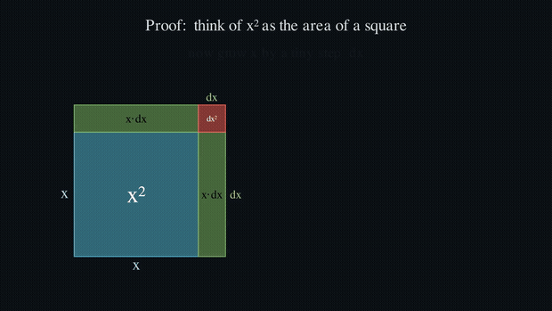

# 🎬 manim-math-explainer

> An open-source **AI-agent Skill** for creating 3Blue1Brown-style animated
> math, calculus, physics, and STEM explainer videos with
> [Manim](https://www.manim.community/).

[](LICENSE)
[](https://www.manim.community/)
[](https://docs.claude.com/en/docs/agents-and-tools/agent-skills)

Give your AI agent the ability to turn *"make me a video explaining why the
derivative of x² is 2x"* into an actual rendered, narrated-quality animation —
the kind you'd see on 3Blue1Brown.

<p align="center">
  
</p>

*(Above: a frame sequence from the bundled example — the growing-square proof
that `d/dx[x²] = 2x`.)*

---

## What this is

This repo is a [**Skill**](https://docs.claude.com/en/docs/agents-and-tools/agent-skills):
a small, self-contained package of instructions + scripts + references that
teaches an AI coding agent (Claude Code, and any agent that supports the
`SKILL.md` format) how to do a specialized task well — here, building Manim
explainer videos end to end:

- 🧰 **Bootstraps the environment** — venv, Manim, cairo/pango/ffmpeg, across
  macOS & Linux (`scripts/setup_env.sh`).
- ✍️ **Teaches good scene design** — 3b1b narrative principles + a tested
  ManimCE cheatsheet.
- 🚫 **Works without LaTeX** — most machines don't have a multi-GB TeX install,
  so the skill renders math with Pango `Text` + Unicode and documents every
  hidden-LaTeX trap (`DecimalNumber`, axis labels) that crashes naïve renders.
- 🔍 **Verifies before delivering** — extracts frames so the agent *looks* at
  the layout and catches off-screen / overlapping bugs before the final render.
- 📚 **Ships ready-made recipes** — derivatives, Riemann sums & integrals, the
  Fundamental Theorem, limits/ε–δ, the chain rule, Taylor series, vectors.

It is **MIT-licensed and free for any AI agent or human to use.**

## Demo

The bundled example, [`examples/derivative_x2.py`](examples/derivative_x2.py),
answers *"why is d/dx[x²] = 2x?"* two ways — as the slope of the parabola (a
sliding tangent line with a live slope read-out) and as a geometric proof (a
growing square). Render it:

```bash
bash scripts/setup_env.sh demo          # one-time: venv + Manim + system libs
cd demo && source .venv/bin/activate
cp ../examples/derivative_x2.py .
bash ../scripts/render.sh derivative_x2.py DerivativeOfXSquared h   # 1080p60
# -> media/videos/derivative_x2/1080p60/DerivativeOfXSquared.mp4
```

## Use it with an AI agent

### Claude Code

Install the skill where Claude Code discovers skills, then just ask:

```bash
# personal (all projects):
git clone https://github.com/ahkamboh/manim-math-explainer.git \
  ~/.claude/skills/manim-math-explainer

# or per-project:
git clone https://github.com/ahkamboh/manim-math-explainer.git \
  .claude/skills/manim-math-explainer
```

Then in a session:

> *"Make a video explaining Riemann sums."*
> *"Animate why the chain rule works."*
> *"Turn the Fundamental Theorem of Calculus into a 60-second explainer."*

The skill triggers automatically — the agent reads `SKILL.md`, sets up the
environment if needed, writes the scene from the closest recipe, draft-renders,
checks frames, and delivers the final mp4.

### Any other agent

The skill is just Markdown + shell + Python. Point your agent at
[`SKILL.md`](SKILL.md) as the entry point; it links out to the references and
scripts as needed (progressive disclosure).

## What's inside

```
manim-math-explainer/
├── SKILL.md                      # entry point: the end-to-end workflow
├── scripts/
│   ├── setup_env.sh              # bootstrap venv + Manim + cairo/pango/ffmpeg
│   ├── render.sh                 # render with PKG_CONFIG_PATH set (macOS-safe)
│   └── verify_frames.sh          # extract frames for visual QA
├── references/
│   ├── manim-cheatsheet.md       # core ManimCE API patterns
│   ├── no-latex-mode.md          # render math without LaTeX (and the gotchas)
│   └── topic-recipes.md          # blueprints: derivatives, integrals, FTC, …
├── examples/
│   └── derivative_x2.py          # full working no-LaTeX scene
└── assets/
    └── preview.gif
```

## Requirements

- **Python 3.11 or 3.12** (Manim's C-extension deps may lack wheels on the very
  newest Python).
- **ffmpeg**, plus **cairo**, **pango**, **pkg-config** — installed automatically
  by `scripts/setup_env.sh` (Homebrew on macOS, apt on Debian/Ubuntu).
- **LaTeX is NOT required.** Install it only if you want publication-grade
  typesetting — see [`references/no-latex-mode.md`](references/no-latex-mode.md).

## Why no-LaTeX by default?

A full TeX distribution is several gigabytes and a frequent source of
`latex not found` render failures. For the vast majority of explainers, Pango
`Text` with Unicode math (`x²`, `∫`, `Δ`, `→`, …) looks great and *just works*
everywhere. The skill documents the exact spots where Manim secretly calls LaTeX
(`DecimalNumber`, `Integer`, `Axes.get_axis_labels()`) and how to route around
them — and how to opt back into real LaTeX if you want it.

## Credits

- Built on [Manim Community Edition](https://www.manim.community/).
- Inspired by [3Blue1Brown](https://www.3blue1brown.com/) (Grant Sanderson),
  whose original [manim](https://github.com/3b1b/manim) started it all.
- This repo is an independent, community skill — not affiliated with or endorsed
  by 3Blue1Brown or the Manim project.

## License

[MIT](LICENSE) © 2026 Ali Hamza Kamboh. Use it freely, for agents and humans
alike. PRs adding new topic recipes are very welcome.
